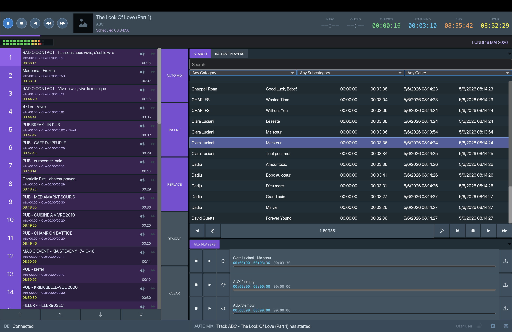
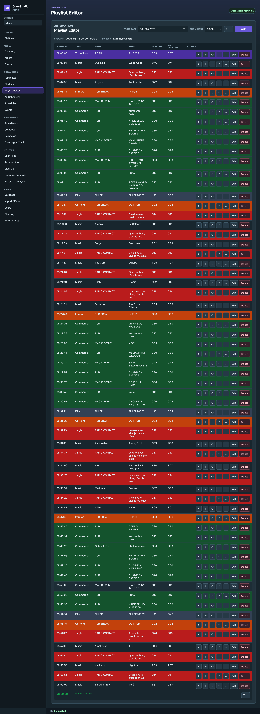

# OpenStudio

Professional broadcast radio software.

[](https://github.com/mickaelmonsieur/OpenStudio/actions/workflows/release.yml)
[](https://github.com/mickaelmonsieur/OpenStudio/releases/latest)
[](LICENCE)
[](LICENCE)
[](https://ko-fi.com/Y8Y5MXCW)

## Screenshots

Player:



Admin in Web UI:



## Player REST API

The Rust player exposes playback-control endpoints on `0.0.0.0:7080`.
See [docs/rest-api.md](docs/rest-api.md) for the route reference.
The Bruno test collection is available in [bruno/openstudio-player-rest](bruno/openstudio-player-rest).

## Platform Support

OpenStudio is developed primarily for macOS on Apple Silicon. macOS Intel builds are provided for legacy machines while the platform remains practical to support.

> **macOS Intel warning:** Apple has confirmed that macOS 26 Tahoe is the final major macOS release for Intel Macs. macOS 27 is expected in September 2026 and will be limited to Macs with Apple Silicon; its beta cycle is expected to start on Monday, June 8, 2026.
>
> For production installations on Intel Macs, the recommended path is to install Ubuntu 26.04 LTS and use the Linux `amd64` packages instead of staying on macOS.

The Windows version is expected to follow the macOS version, but it may need extra testing on real broadcast setups. If you hit a Windows-specific problem, please open a [GitHub Issue](https://github.com/mickaelmonsieur/OpenStudio/issues) or send a [Pull Request](https://github.com/mickaelmonsieur/OpenStudio/pulls).

## Audio Format Support

OpenStudio currently supports FLAC files only, and we do not plan to change this. This is an intentional product choice.

Professional broadcast software has often made similar format choices: many systems historically standardized on MPEG-1 Layer II (`.mp2`), while modern broadcast workflows commonly standardize on WAV. OpenStudio standardizes on FLAC because it is lossless, royalty-free, widely available, and already used by major music platforms such as Deezer.

Why not WAV? WAV is an excellent professional format, but FLAC gives the same audio restitution as an equivalent uncompressed PCM WAV after decoding, while using less disk space. In other words, FLAC keeps the broadcast-grade audio quality without requiring a full-size WAV library.

We intentionally avoid MP3 as a library format. MP3 has been extremely popular since the early 2000s, but it is too destructive for a professional broadcast library. Radio sound processing works best with clean audio and a healthy musical spectrum.

We encourage you to start building a FLAC music database today and to convert your existing files where needed. If you convert from MP3, start from high-quality files such as 256 kbps or better; lower bitrate files will usually give poor results once they pass through broadcast audio processing.

If your library contains other formats, convert them to FLAC before importing them into OpenStudio. Depending on your platform, you can use tools such as [fre:ac](https://www.freac.org/downloads-mainmenu-33) or [FFmpeg](https://ffmpeg.org/) for more technical workflows.

## Installation

Install the components in this order, regardless of your operating system:

1. Install PostgreSQL.
2. Install OpenStudio.
3. Initialize the database from OpenStudio.
4. Install OpenStudio Admin.

OpenStudio must be installed and used to initialize the database before installing or launching OpenStudio Admin.

## Default Seed Users

The seeded database includes these default application users:

| Role | Login | Password |
| --- | --- | --- |
| Admin | `admin` | `admin123` |
| Manager | `manager` | `changeme123` |
| User | `user` | `user` |

Admin rights are required to modify the OpenStudio application configuration. Database Settings are the exception: they can be opened and changed without an application login or password.

### macOS Apple Silicon

Download the two DMG files from the [latest release](../../releases/latest):

- `openstudio_x.x.x_macos_arm64.dmg` — the audio player
- `openstudio-admin_x.x.x_macos_arm64.dmg` — the admin interface *(only needed on the machine that manages the library)*

Open the OpenStudio DMG and drag the app to your Applications folder. Launch OpenStudio, open **Database Settings**, then create or initialize the database.

After the database is ready, open the OpenStudio Admin DMG and drag the app to your Applications folder.

> **First launch warning:** macOS will display "unidentified developer" because the app is not notarized.
> Go to **System Settings → Privacy & Security → Open Anyway**.
>

**PostgreSQL 18 is required.** On macOS, use [Postgres.app](https://postgresapp.com/downloads.html) — it is a universal binary (Intel + Apple Silicon). The EnterpriseDB installer is x86-64 only and runs under Rosetta.

#### macOS Intel

Intel Macs can use the dedicated `x64` DMG files from the [latest release](../../releases/latest):

- `openstudio_x.x.x_macos_x64.dmg` — the audio player
- `openstudio-admin_x.x.x_macos_x64.dmg` — the admin interface *(only needed on the machine that manages the library)*

Install them the same way as the Apple Silicon builds: install OpenStudio first, initialize the database from **Database Settings**, then install OpenStudio Admin.

> **Legacy platform warning:** macOS Intel support is temporary. macOS 27 will not install on Intel Macs, so these builds are intended only for existing Intel macOS deployments that cannot migrate immediately.
>
> For a longer-lived setup on Intel Mac hardware, install Ubuntu 26.04 LTS and use the Linux `amd64` packages.

**PostgreSQL 18 is required.** Use [Postgres.app](https://postgresapp.com/downloads.html); the PostgreSQL 18 DMG is Universal, so the same download works on Intel and Apple Silicon Macs.

---

### Windows

Download the two installers from the [latest release](../../releases/latest):

- `openstudio_x.x.x_windows_x64_setup.exe` — the audio player
- `openstudio-admin_x.x.x_windows_x64_setup.exe` — the admin interface *(only needed on the machine that manages the library)*

Run the OpenStudio installer first. Launch OpenStudio, open **Database Settings**, then create or initialize the database.

After the database is ready, run the OpenStudio Admin installer. Windows may show a SmartScreen warning for unsigned apps — click **More info → Run anyway**.

**PostgreSQL 18 (x86-64) is required.** Download and install it from [enterprisedb.com](https://www.enterprisedb.com/downloads/postgres-postgresql-downloads).

---

### Linux

Download the two Debian packages from the [latest release](../../releases/latest):

- `openstudio_x.x.x_linux_amd64.deb` or `openstudio_x.x.x_linux_arm64.deb` — the audio player
- `openstudio-admin_x.x.x_linux_amd64.deb` or `openstudio-admin_x.x.x_linux_arm64.deb` — the admin interface *(only needed on the machine that manages the library)*

Install PostgreSQL 18 first. On Debian and Ubuntu, use the official PostgreSQL APT repository so you get PostgreSQL 18 even when your distribution ships an older major version:

```bash
sudo apt install -y postgresql-common
sudo /usr/share/postgresql-common/pgdg/apt.postgresql.org.sh
sudo apt update
sudo apt install -y postgresql-18
sudo systemctl enable --now postgresql
sudo -u postgres psql -c "ALTER USER postgres PASSWORD 'change-this-password';"
```

Then install OpenStudio and launch it once to open **Database Settings** and create or initialize the database:

```bash
sudo apt install ./openstudio_x.x.x_linux_amd64.deb
```

In **Database Settings**, keep `localhost`, port `5432`, user `postgres`, and enter the password you set above. The default `psql` path for Linux is `/usr/lib/postgresql/18/bin/psql`.

On Linux, OpenStudio saves the edited database connection to `~/.config/openstudio/database.json`. The packaged `/usr/lib/openstudio/database.json` file is only used as the first-run default.

After the database is ready, install OpenStudio Admin:

```bash
sudo apt install ./openstudio-admin_x.x.x_linux_amd64.deb
```

On Linux, new station library folders default to `~/OpenStudio/Library`.

Use the `arm64` package names instead on ARM machines.

Use `apt install ./package.deb`, not `dpkg -i`, so Debian/Ubuntu can install package dependencies such as `libxss1`. If you already used `dpkg -i` and the package was left unconfigured, run:

```bash
sudo apt --fix-broken install
```

**PostgreSQL 18 is required.** The PostgreSQL APT repository supports current Debian and Ubuntu releases on `amd64` and `arm64`; check the PostgreSQL Linux download pages if your distribution or architecture differs.

---

## 💼 Professional support

I'm available for consulting for radio stations interested in deploying OpenStudio in production.

👉 [mickael.be](https://www.mickael.be)

---

## ☕ Buy me a coffee

If OpenStudio helps your radio workflow, consider buying me a coffee!

[](https://ko-fi.com/Y8Y5MXCW)

---

## 📄 Licence

GNU General Public License v3.0

https://www.gnu.org/licenses/gpl-3.0.en.html

See [LICENCE](LICENCE).
